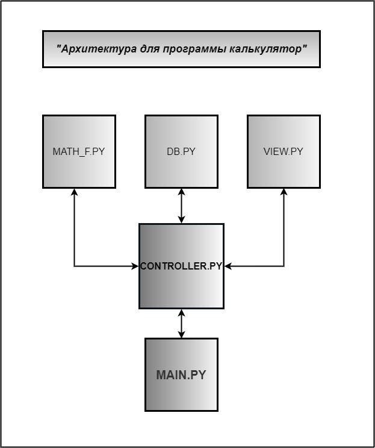

# Python Project

## Создать калькулятор для работы с рациональными и комплексными числами, организовать меню, добавив в неё систему логирования
***
### Команда проекта

1. Андрей - Teamlead (сборка + проверка кода + view.py)
    * [проект на GitHub](https://github.com/AZavershinskiy/Calculator_sem07.git)

2. Валентин - math_f.py + main.py + блок-схема 
    * [проект на GitHub](https://github.com/ValentinGolban99/Calculator_sem07.git)

3. Надежда - db.py + controller.py + файл README.md
    * [проект на GitHub](https://github.com/NadezhdaBrin/Calculator_sem07.git)

***
 ### Блок-схема архитектуры программы Калькулятор
* 

### архитектура проекта

* Создание модуля для ввода и вывода. `view.py`

   Калькулятор принимает на вход два числа, рациональные или комплексные.

* Создание модуля для выполнения арифметических операций: . `math_f.py`
    - сложение   `summ`
    - вычитание  `subtraction`
    - умножение  `multiply`
    - деление    `division`

* Создание модуля запуска программы. `main.py`

* Создание модуля для логирования. `db.py`
    - Все ответы записываются в уже созданный файл. `logs.txt`

* Создание модуля который управляет остальными модулями  `controller.py`
 

